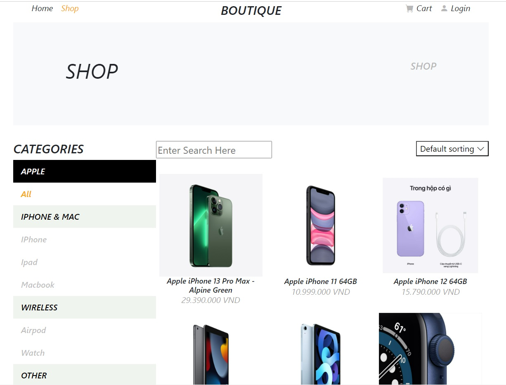

# E-COMMERCE WEBSITE

## The completion time: 
15/10/2022 - 16/11/2022

## Link demo
[View demo](https://e-commerce-website-gamma-livid.vercel.app/home)

## Overview
- This project helps shoppers signup, login, store the number of products they want to buy, view their shopping cart, view detailed prices, view the total price, delete products from the cart, easily view the list of goods, and view the details of any product they desire.

## Program Language 
HTML, CSS, Javascript, JSX, ReactJS, Bootstrap, React-router, Redux Toolkit   

## Home Page
- On the home page, you can view the navigation bar with four options: Home, Shop, Cart, and Login. In addition, you can also view important information on the banner, see the list of categories, and view the products that are top trending.

- On the top trending products on the home page, you can see more detailed information by clicking on the image and then clicking "View Detail".

## Auth Page
- The website also has a function for registering an account, logging in, and logging out with the required criteria.

## Shop Page
- On the Shop Page, you can view a list of products that have been categorized according to the shop's categories. If you click on a product, you will see the detailed information for that product.

## Detail Page
- On the product detail page, you can see information about the product's uses, the product's price, and see a list of related products. Additionally, you can also add the product to your cart with the desired quantity.

## Cart Page
On the Cart Page, you can view the list of products you have added to your cart, you can view the total price of each product and the total price of all products, in addition you can also increase, decrease the quantity of products or remove products from your cart.
